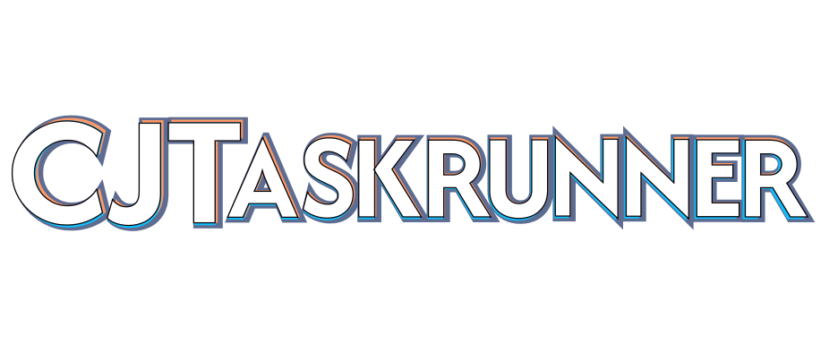

<div align="center" style="display:flex;align-items:center;justify-content:center;margin-bottom:0;">
  
  
</div>
<div align="center" style="margin:0;text-align:center;font-size:1.4em;">
  Independent task wrangler
</div>
<div align="center" style="display:flex;align-items:center;justify-content:center;margin-bottom:0;">


  
</div>

## About CJTaskrunner

CJTaskrunner is a lightweight command-line task runner for Linux and macOS. It has a near-zero learning curve. The `cjtasks` file acts as one catalog for a repository's development, build, and release workflows.

Install the latest release:

```sh
curl -fsSL https://raw.githubusercontent.com/jgusta/cjtaskrunner/main/install.sh | bash
```

## Get started

### Syntax

A `cjtasks` file task consists of a label and the command to run:

```cjtasks
build:
  npm run build
dev:
  npm run dev
```

Run a task  by invoking its name from the same directory:
```shell
> cj dev
```

### Listing

The CJTaskrunner executable, `cj` lists the available tasks when run by itself:

```shell
> cj
Tasks in cjtasks:
   build
   dev
```

Annotate your tasks with the `@desc` directive:
```cjtasks
build:
  @desc build for release using npm
  npm run build
dev:
	@desc build for development and start preview
  npm run dev
```

...and they will show when in the task list:
```shell
> cj
Tasks in cjtasks:
   build                build for release using npm
   dev                  build for development and start preview
```

You don't need to even write these tasks out yourself. If you have a `package.json`, `deno.json`, `Makefile`, or `Justfile` you can automatically create your taskfile:

```shell
cj --auto
```

## Learn more

That's all you need to know to effectively use CJTaskrunner. Every additional feature is optional and exists only where it make things easier and saves time. Go as deep as you want to, the syntax is consistent and terse.

Read the [manual](https://jgusta.github.io/cjtaskrunner/directives.html#shell) for the taskfile
format, directive reference, and editor setup.

## Why CJTaskrunner?

### CJTaskrunner has its own task format:
- Uses a small domain-specific language, simpler than YAML
- Top-level entries are your task name
- Indented lines are commands that run like your shell would (though [CJTaskrunner is not a shell](https://jgusta.github.io/cjtaskrunner/reference/directives.html#shell))

All other lines are fully optional directives. These are flat with only user-supplied names or paths: 
- Control task flow with `@if`, `@else`, `@switch`,  `@stop`, `@success`, `@fail`, `@and`, `@or`
- Manipulate environment variables with `@set`, `@env:`, `@export` and interpolate them in commands
- Navigate the file system using `@cd`, `@back`, `@mkdir`, `@cp`, `@rename`, `@clean`

### CJTaskrunner is built for modern workflows:
- **Asynchronous task execution** with `@await`
- Tasks are discoverable and **self-documenting** from the command line
- Tasks are **composable** and isolated
- Strings are plain text; use quotes only when the command being run needs them
- Interpolate and manipulate environment variables, or have your task accept **arguments** that will be passed to your commands
- Can automatically add all your tasks from npm's `package.json`, `deno.json`, `Makefile`, and `Justfile`

### CJTaskrunner is new but it has mature features:
- A **language server** built into the executable
- Organize your tasks into **subtasks**
- An official VS Code extension with syntax highlighting, inline help, outline support, a formatter and a task list panel
- Installation **via Homebrew** or a one-line shell installer
- **Shell-completions** for bash, zsh and fish
- Automatic Python virtualenv sourcing


## License

MIT. Copyright (c) 2026 jgusta.
