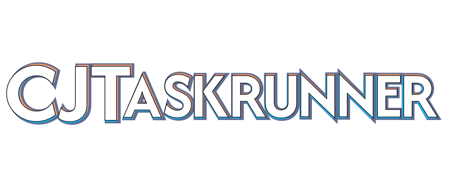

<div align="center" style="display:flex;align-items:center;justify-content:center;margin-bottom:0;">
  
  
</div>
<div align="center" style="margin:0;text-align:center;font-size:1.4em;">
  Independent task wrangler
</div>


<div align="center" style="display:flex;align-items:center;justify-content:center;margin-bottom:0;"> </div>


## About CJTaskrunner

Designed for lazy people, CJTaskrunner is a lightweight command-line task runner for Linux and macOS. It does not expect you to learn it's syntax; it has a near-zero learning curve. The `cjtasks` file acts as one catalog for a repository's development, build, and release workflows. It is the `README.md` of task files.

Unlike other task runners, our top priority is not having to learn anything. Type `cj` to see the tasks. If you write a task you can learn enough syntax by reading to the end of this sentence: task, colon, new line, space, space, command.

- Guaranteed smallest taskrunner syntax.
- Domain-specific language; the domain is terseness.
- Guaranteed to lower cognitive load and the need to memorize anything.
- No curly braces, no square braces, no underscores, no capital letters, no slashes, no dots.
- You will not need to put things in quotation marks on CJTaskrunners' behalf. CJTaskrunner hates unnecessary quotation marks.
- Strings are first class citizens in the sense that they have no semantic meaning to CJTaskrunner and don't require quotation marks or escaping.
- Directive names, should you choose to use them, are the first thing on the line, and have no options.
- Runs your tasks directly without using the shell (if you must use shell features, you can do that too).
- You can nest tasks one level. **We don't let you go any deeper than that.**
- All input to directives is user-supplied paths or strings. 
- Hide the complexity or ugliness of your other scripts or task runners by using CJTaskrunner.
- People viewing who know CJTaskrunner will always be stoked that you have a cjtasks file in your repo.

## Get started

Install the latest release:

```sh
curl -fsSL https://raw.githubusercontent.com/jgusta/cjtaskrunner/main/install.sh | bash
```

### Syntax

A `cjtasks` file task consists of a label and the command to run:

```cjtasks
build:
  npm run build
dev:
  npm run dev
```

Run a task by invoking its name from the same directory:

```shell
> cj dev
```

### Listing

The CJTaskrunner executable, `cj` lists the available tasks when run by itself:

```shell
> cj
Tasks in cjtasks:
   build
   dev
```

Annotate your tasks with the `@desc` directive:
```cjtasks
build:
  @desc build for release using npm
  npm run build
dev:
	@desc build for development and start preview
  npm run dev
```

...and they will show when in the task list:
```shell
> cj
Tasks in cjtasks:
   build                build for release using npm
   dev                  build for development and start preview
```

You don't need to even write these tasks out yourself. If you have a `package.json`, `deno.json`, `Makefile`, or `Justfile` you can automatically create your taskfile:

```shell
cj --auto
```

## Learn more

That's all you need to know to effectively use CJTaskrunner. Every additional feature is optional and exists only where it make things easier and saves time. Go as deep as you want to, the syntax is consistent and terse.

Read the [manual](https://jgusta.github.io/cjtaskrunner/directives.html#shell) for the taskfile
format, directive reference, and editor setup.

## Why CJTaskrunner?

### CJTaskrunner has its own task format:
- Uses a small domain-specific language, simpler than YAML
- Top-level entries are your task name
- Indented lines are commands that run like your shell would (though [CJTaskrunner is not a shell](https://jgusta.github.io/cjtaskrunner/reference/directives.html#shell))

All other lines are fully optional directives. These are flat with only user-supplied names or paths: 
- Control task flow with `@if`, `@else`, `@switch`,  `@stop`, `@success`, `@fail`, `@and`, `@or`
- Manipulate environment variables with `@set`, `@env:`, `@export` and interpolate them in commands
- Navigate the file system using `@cd`, `@back`, `@mkdir`, `@cp`, `@rename`, `@clean`

### CJTaskrunner is built for modern workflows:
- **Asynchronous task execution** with `@await`
- Tasks are discoverable and **self-documenting** from the command line
- Tasks are **composable** and isolated
- Strings are plain text; use quotes only when the command being run needs them
- Interpolate and manipulate environment variables, or have your task accept **arguments** that will be passed to your commands
- Can automatically add all your tasks from npm's `package.json`, `deno.json`, `Makefile`, and `Justfile`

### CJTaskrunner is new but it has mature features:
- A **language server** built into the executable
- Organize your tasks into **subtasks**
- An official VS Code extension with syntax highlighting, inline help, outline support, a formatter and a task list panel
- Installation **via Homebrew** or a one-line shell installer
- **Shell-completions** for bash, zsh and fish
- Automatic Python virtualenv sourcing


## License

MIT. Copyright (c) 2026 jgusta.
